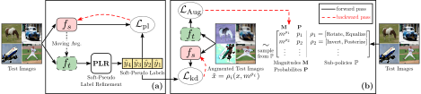

#  <b>TeSLA: Test-Time Self-Learning With Automatic Adversarial Augmentation</b>

This repository contains official [PyTorch](https://pytorch.org/) implementation for [CVPR 2023](https://cvpr2023.thecvf.com/) paper **TeSLA: Test-Time Self-Learning With Automatic Adversarial Augmentation** by Devavrat Tomar, Guillaume Vray, Behzad Bozorgtabar, and Jean-Philippe Thiran.

### *Abstract*
Most recent test-time adaptation methods focus on only classification tasks, use specialized network architectures, destroy model calibration or rely on lightweight information from the source domain. To tackle these issues, this paper proposes a novel **Te**st-time **S**elf-**L**earning method with automatic **A**dversarial augmentation dubbed **TeSLA** for adapting a pre-trained source model to the unlabeled streaming test data. In contrast to conventional self-learning methods based on cross-entropy, we introduce a new test-time loss function through an implicitly tight connection with the mutual information and online knowledge distillation. Furthermore, we propose a learnable efficient adversarial augmentation module that further enhances online knowledge distillation by simulating high entropy augmented images. Our method achieves state-of-the-art classification and segmentation results on several benchmarks and types of domain shifts, particularly on challenging measurement shifts of medical images. TeSLA also benefits from several desirable properties compared to competing methods in terms of calibration, uncertainty metrics, insensitivity to model architectures, and source training strategies, all supported by extensive ablations.

### *Overview of TeSLA Framework*

(a) The student model   is adapted on the test images by minimizing the proposed test-time objective  . The high-quality soft-pseudo labels required by  are obtained from the exponentially weighted averaged teacher model  and refined using the proposed Soft-Pseudo Label Refinement (PLR) on the corresponding test images. The soft-pseudo labels are further utilized for teacher-student knowledge distillation via  on the adversarially augmented views of the test images. (b) The adversarial augmentations are obtained by applying learned sub-policies sampled i.i.d from  using the probability distribution  with their corresponding magnitudes selected from . The parameters  and  of the augmentation module are updated by the *unbiased gradient estimator* of the loss  computed on the augmented test images.

#### [[arxiv]](https://arxiv.org/abs/xxxxxx) [[Project]](https://behzadbozorgtabar.com/TeSLA.html)

## **Requirements**

## **Dataset Download Links**
### (1) CIFAR-10C, CIFAR-100C
### (2) ImageNet-C
### (3) VisDA-C
### (4) Kather
### (5) VisDA-S
### (6) MRI

## **Pre-trained Source Models**

## **Code for training Source Models from scratch**

## **Examples for adapting source models using TeSLA**

## Classification on CIFAR, ImageNet, VisDA, and Kather datasets

### (1) Common Image Corruptions: CIFAR-10C
### (2) Common Image Corruptions: CIFAR-100C
### (3) Common Image Corruptions: ImageNet-C
### (4) Synthetic to Real Adaptation: VisDA-C
### (5) Medical Measurement Shifts: Kather

## Segmentation  on VisDA-S and MRI datasets

### (1) GTA5 to CityScapes
### (2) Domain shifts of MRI

## **Licence**